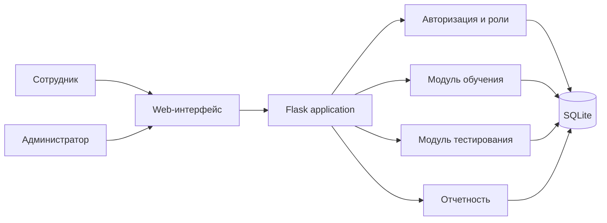
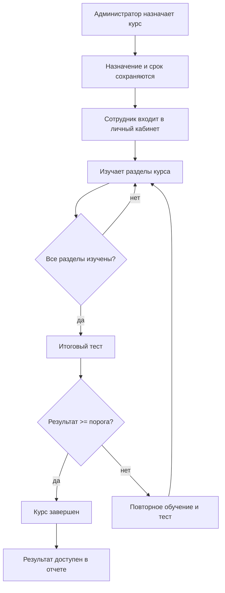
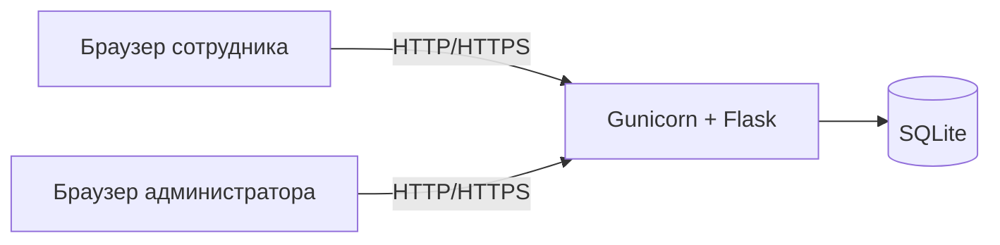

# Архитектура системы

## Назначение

Система автоматизирует путь от назначения курса сотруднику до фиксации результата проверки знаний. Основные пользователи: сотрудник организации и ответственный специалист по охране труда.

## Основной сценарий

## Разделение ответственности

- `routes.py` содержит web-сценарии, проверки доступа и бизнес-операции;
- `db.py` отвечает за структуру базы, подключение и исходные демонстрационные данные;
- Jinja templates формируют интерфейс пользователя;
- SQLite хранит учетные записи, курсы, назначения, прогресс и результаты.

## Безопасность

- пароли хранятся в виде стойкого хеша Werkzeug;
- доступ к административным страницам проверяется по роли;
- сотрудник не может открыть чужое назначение;
- изменяющие запросы защищены CSRF-токеном;
- сессия подписывается секретным ключом приложения;
- SQL выполняется параметризованными запросами.

## Отказоустойчивое поведение

| Ситуация | Поведение |
|---|---|
| Неверные учетные данные | вход отклоняется без раскрытия причины |
| Сотрудник открывает admin URL | HTTP 403 |
| Попытка открыть чужой курс | HTTP 403 |
| Тест запущен до завершения материалов | возврат к курсу с сообщением |
| Повторное назначение того же курса | понятное сообщение без дублирования |
| В курсе нет вопросов | тест не запускается, возвращается ошибка конфигурации |

## Развертывание

Для защиты достаточно одного Linux-компьютера или бесплатного web-хостинга. В production-варианте рекомендуется reverse proxy, HTTPS, отдельная СУБД и резервное копирование.
