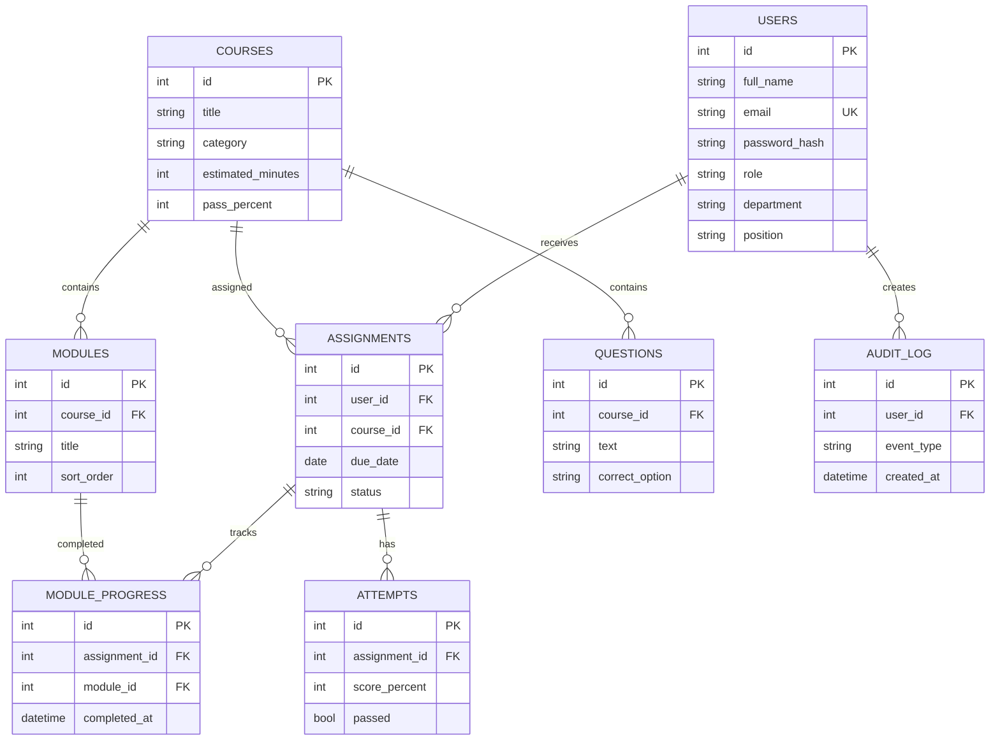

# Модель данных

```mermaid
erDiagram
    USERS ||--o{ ASSIGNMENTS : receives
    COURSES ||--o{ ASSIGNMENTS : assigned
    COURSES ||--o{ MODULES : contains
    COURSES ||--o{ QUESTIONS : contains
    ASSIGNMENTS ||--o{ MODULE_PROGRESS : tracks
    MODULES ||--o{ MODULE_PROGRESS : completed
    ASSIGNMENTS ||--o{ ATTEMPTS : has
    USERS ||--o{ AUDIT_LOG : creates

    USERS {
      int id PK
      string full_name
      string email UK
      string password_hash
      string role
      string department
      string position
    }
    COURSES {
      int id PK
      string title
      string category
      int estimated_minutes
      int pass_percent
    }
    ASSIGNMENTS {
      int id PK
      int user_id FK
      int course_id FK
      date due_date
      string status
    }
    MODULES {
      int id PK
      int course_id FK
      string title
      int sort_order
    }
    QUESTIONS {
      int id PK
      int course_id FK
      string text
      string correct_option
    }
    MODULE_PROGRESS {
      int id PK
      int assignment_id FK
      int module_id FK
      datetime completed_at
    }
    ATTEMPTS {
      int id PK
      int assignment_id FK
      int score_percent
      bool passed
    }
    AUDIT_LOG {
      int id PK
      int user_id FK
      string event_type
      datetime created_at
    }
```
